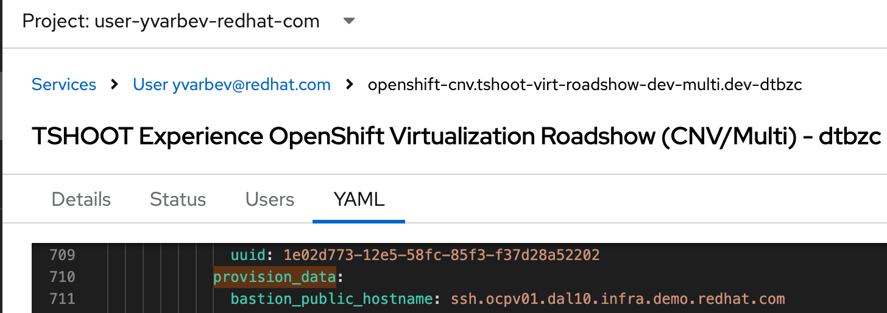

== Load-Testing VM Migration with MTV

=== Changes

2024-08-02: variable added: `provision_data_file`.  Defaults to `./provision_data.yaml`

=== Prerequisites

.Setting Up Provision Data for your target cluster
* Deploy a multi-user virt roadshow catalog item
* Get the provision_data dict from the Babylon output and save it to `./provision_data.yaml`
** You can find the provision data in the YAML tab of ResourceHandle of your order.
+

+
NOTE: Make sure to get all the users from the provision_data yaml.
The playbook will use them and their auth credentials to login to the OCP cluster provider.

=== Install requirements.yml

Use your favorite python virtual environment manager to install the requirements.

I use https://github.com/pyenv/pyenv?tab=readme-ov-file[pyenv] with https://github.com/pyenv/pyenv-virtualenv[pyenv-virtualenv]

. `pyenv virtualenv migration_test`
. `pip install ansible`
. `ansible-galaxy role install -r requirements.yml`
. or for newer ansible versions use `ansible-galaxy collection install -r requirements.yml`

=== Run the playbook

The playbook searches for `./provision_data.yaml` and uses that to authenticate as each user to the cluster.

 ansible-playbook ./playbook_multi.yml -e

You can also indicate a different provision_data_file:

 ansible-playbook ./playbook_multi.yml -e provision_data_file=./provision_data2.yaml

You can limit the number of users created with `-e ceiling=10`:

 ansible-playbook ./playbook_multi.yml -e ceiling=10

=== Cleanup

. First try deleting everything, but only setting the plans to Archived=true, per the docs.
I don't see how it actually really cleans up anything, but I like to be a good citizen.

 ansible-playbook ./delete_all.yaml -e delete_plans=false -e provision_data_file=./provision_data2.yaml

. Second, the Plans will not go away in Archived=true mode, so run the playbook again, with `delete_plans=true`

 ansible-playbook ./delete_all.yaml -e delete_plans=true -e provision_data_file=./provision_data2.yaml
